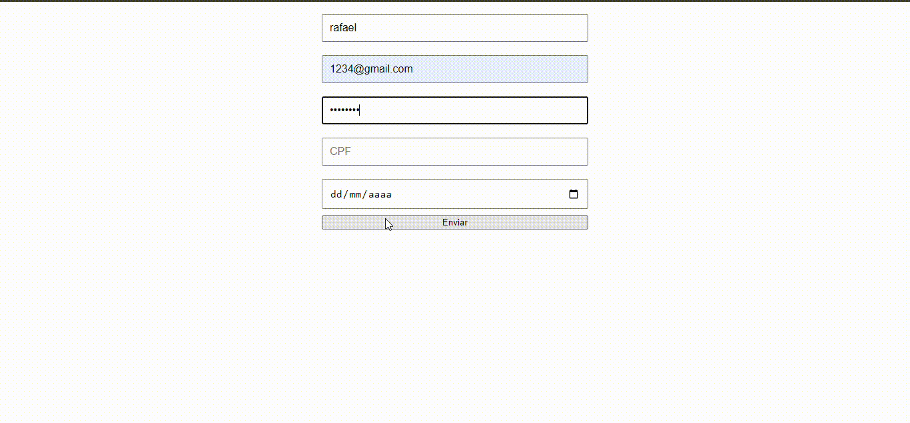

# form-CadCompleto
* [Formulário de Cadastro](#formulário-de-cadastro)
* [Funcionalidades Login](#funcionalidades-login)
* [Endereço](#endereço)
* [Funcionalidades End](#funcionalidades-end)
* [Tecnologias utilizadas](#tecnologias-utilizadas)
* [Autores](#autores)

## Formulário de Cadastro

Este é um projeto de formulário de cadastro simples, que permite ao usuário inserir informações pessoais, como nome, e-mail, senha, CPF e data de nascimento. O formulário inclui validações para garantir que todos os campos sejam preenchidos corretamente antes de redirecionar o usuário para outra página.

## Funcionalidades Login

- Validação de campos obrigatórios (nome, e-mail, senha, CPF e data de nascimento).
- Validação do formato do e-mail.
- Validação do CPF, garantindo que ele seja válido.
- Verificação da data de nascimento, garantindo que seja uma data passada.
- Redirecionamento para uma nova página após o envio bem-sucedido do formulário.

## Endereço
Após o login, se estiver certo todos os dados o usuário é redirecionado a página de endereço. O cadastro de endereço que utiliza a API ViaCep para preencher automaticamente os campos de endereço com base no CEP informado. O projeto permite ao usuário inserir dados como CEP, rua, número, bairro, complemento, cidade e estado, facilitando o processo de cadastro.

## Funcionalidades End.

- Preenchimento automático dos campos de endereço ao informar o CEP.
- Validação do CEP para garantir que ele seja um número válido e tenha o comprimento correto.
- Mensagens de erro informativas caso o CEP não seja encontrado ou seja inválido.

## Tecnologias Utilizadas

- HTML
- CSS
- JavaScript
- API ViaCep (https://viacep.com.br)

## Autores
Rafael Souza Mastellini 2-C

